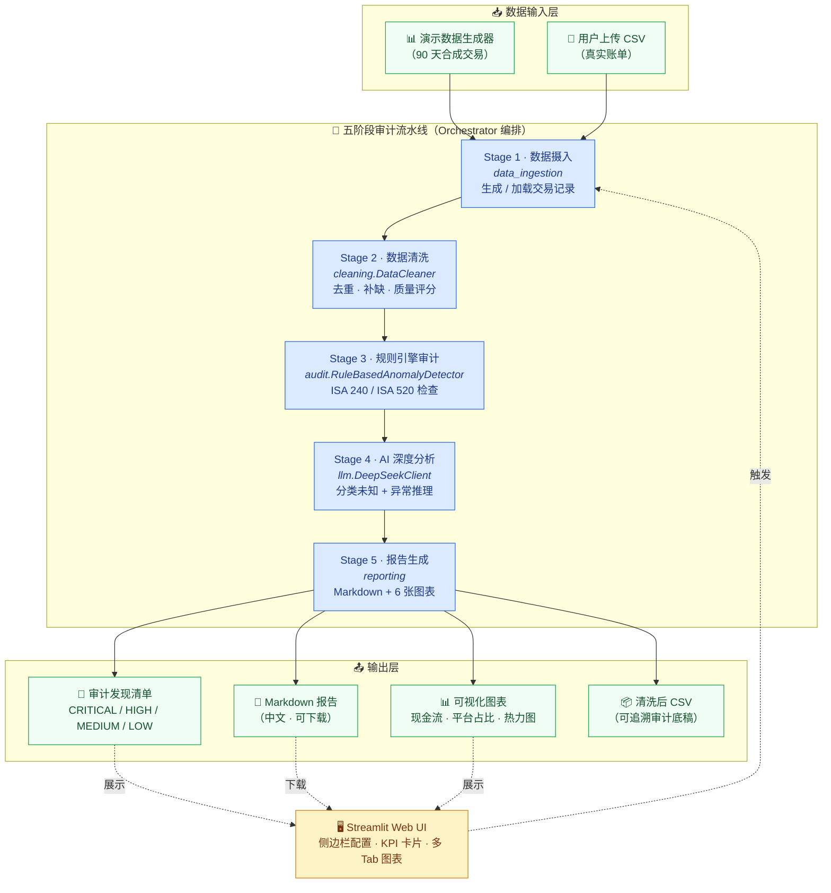
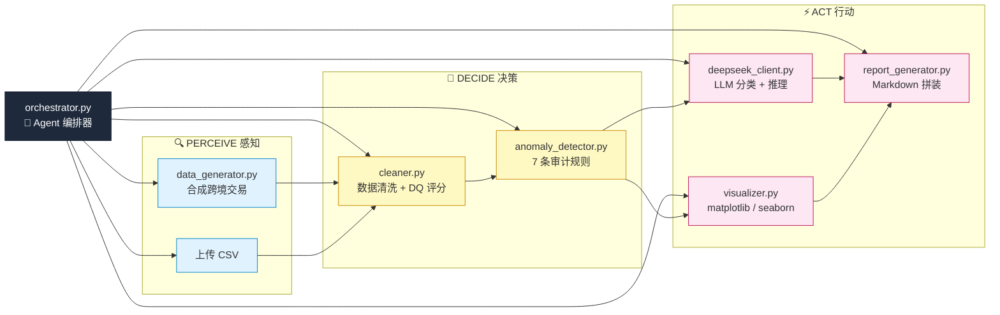
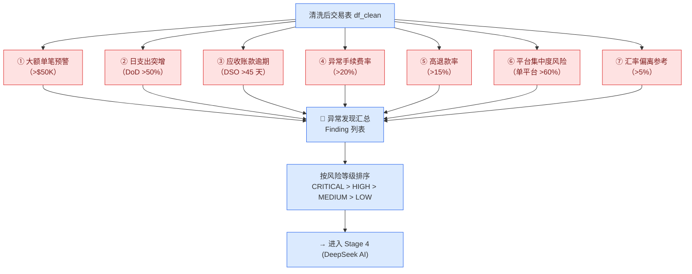
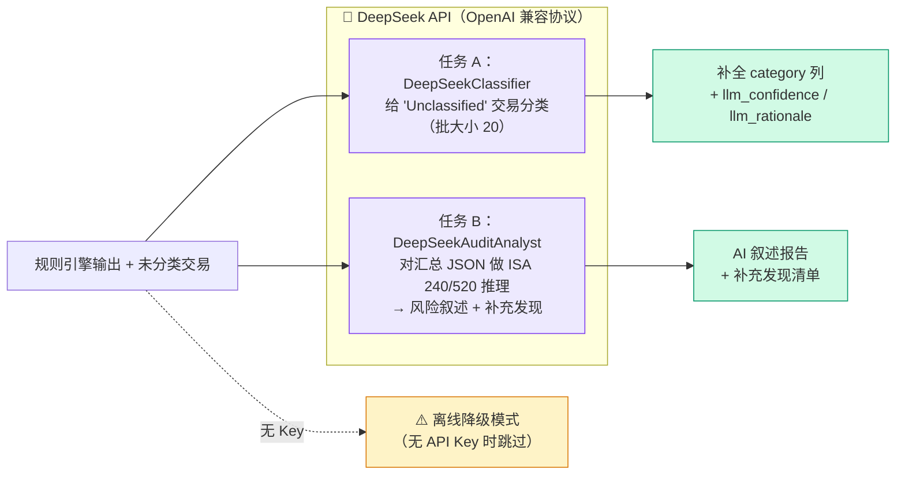
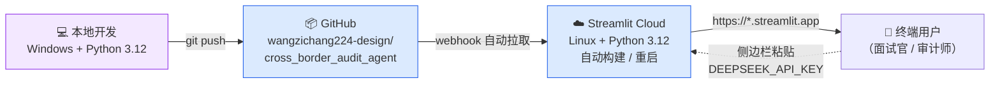

# 系统架构图

跨境电商资金流 AI 审计 Agent —— Perceive → Decide → Act 循环

---

## 一、整体五阶段流水线

---

## 二、模块依赖关系（Perceive · Decide · Act）

---

## 三、规则引擎（Stage 3）的 7 条 ISA 审计规则

---

## 四、AI 分析（Stage 4）双任务

---

## 五、部署架构

---

## 关键设计原则

| 原则 | 体现 |
|------|------|
| **优雅降级** | 没有 API Key 也能跑（规则引擎 + 报告），不会整体崩溃 |
| **可追溯审计底稿** | 每次运行生成独立 `run_id` 目录，CSV + 图表 + 报告齐全 |
| **合规性** | 严格遵循 ISA 240（舞弊风险）和 ISA 520（分析程序） |
| **可移植性** | `config._writable()` 自动检测只读环境，云端兼容 |
| **可扩展性** | LLM 客户端抽象，可替换 Claude / GPT 而不改业务逻辑 |
