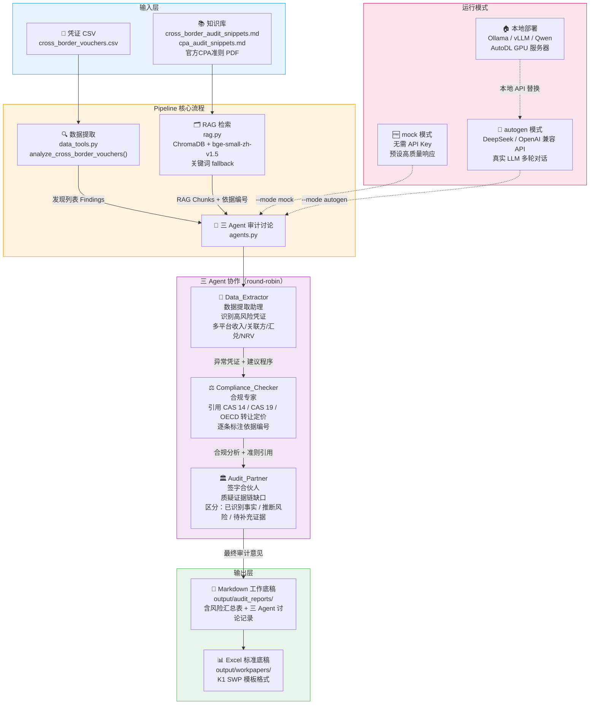

# Cross-Border Audit Agent — 跨境电商多 Agent 审计系统

> 基于 AutoGen + RAG 的三 Agent 审计自动化原型，聚焦**跨境电商**场景（Amazon / TikTok Shop），覆盖转让定价、FBA存货NRV、多币种收入确认、进出口合规等高风险审计领域。

---

## 前端展示与项目结构

这个仓库现在提供一个项目展示型 Streamlit 前端，适合作为 GitHub 主页演示和面试讲解入口：

```bash
streamlit run streamlit_app.py
```

前端包含项目概览、C 货币资金底稿生成、Agent 流水线、Benchmark 隔离设计、仓库结构和运行指南。完整结构说明见 [`docs/PROJECT_STRUCTURE.md`](docs/PROJECT_STRUCTURE.md)。

货币资金底稿可直接通过前端或 CLI 生成：

```bash
python cli.py workpaper --case-type cash --mode mock --materials-dir benchmarks/materials/case_001_minimal --template-root outputs/clean_templates --template-keyword 核心优化版
```

---

## 系统架构与运转流程



---

## 审计场景

### 场景一：跨境电商专项审计（推荐 Demo）

```bash
python -m audit_multi_agent_rag.cli run --case-type cross_border --mode mock
```

**覆盖 8 类跨境审计高风险事项：**

| 凭证 | 金额 | 风险等级 | 审计关注点 |
|---|---|---|---|
| 关联方服务费（香港子公司） | ¥520,000 | 🔴 高 | 转让定价独立性 / BEPS 合规 |
| FBA 海外仓存货减值 | ¥315,000 | 🔴 高 | NRV 评估方法充分性 |
| Amazon 销售结算款 | ¥605,200 | 🟡 中 | 收入确认时点 / 汇率折算 |
| TikTok Shop 回款 | ¥238,400 | 🟡 中 | 多平台截止测试 |
| 期末汇兑损益 | ¥58,640 | 🟡 中 | 外汇敞口 / 折算政策一致性 |
| 进口关税及增值税 | ¥142,000 | 🟡 中 | HS 编码合规 / 进项抵扣 |
| 销售退货准备 | ¥180,000 | 🟡 中 | 退货率假设合理性 |
| FBA 平台服务费 | ¥89,040 | 🟡 中 | 期间配比 / 科目分类 |

### 场景二：固定资产专项审计（原始场景）

```bash
python -m audit_multi_agent_rag.cli run --case-type fixed_asset --mode mock
```

---

## 快速开始

```bash
# 克隆仓库
git clone https://github.com/wangzichang224-design/cross_border_audit_agent.git
cd cross_border_audit_agent

# 安装依赖（轻量版，无需 GPU）
pip install -r requirements-phase1.txt

# 运行跨境电商审计 Demo（无需 API Key）
python -m audit_multi_agent_rag.cli run --case-type cross_border --mode mock

# 查看项目状态
python -m audit_multi_agent_rag.cli where

# 搜索知识库
python -m audit_multi_agent_rag.cli search --query "转让定价 BEPS 关联方" --top-k 3
```

---

## 目录结构

```
cross_border_audit_agent/
├── audit_rag/
│   ├── agents.py          # 三 Agent 提示词 + AutoGen / OpenAI 适配 + mock 响应
│   ├── config.py          # 环境变量和路径管理
│   ├── data_tools.py      # 凭证加载 + 风险规则检测（固定资产 & 跨境电商）
│   ├── pipeline.py        # 审计流程编排（场景路由 / RAG / Agent 调度）
│   ├── rag.py             # ChromaDB 检索 + 关键词 fallback
│   ├── reporting.py       # Markdown 工作底稿生成（含风险汇总表）
│   └── feishu.py          # 飞书 Webhook 集成
├── sample_data/
│   ├── vouchers.csv                # 固定资产案例凭证（4条）
│   └── cross_border_vouchers.csv   # 跨境电商凭证（8条，Amazon/TikTok）
├── sample_knowledge/
│   ├── cpa_audit_snippets.md             # CPA 审计准则摘要
│   └── cross_border_audit_snippets.md    # 跨境专项：CAS14/CAS19/OECD 转让定价/关税
├── knowledge_sources/         # 放入官方 PDF（CPA 审计准则 2023 等）
├── output/
│   ├── audit_reports/         # 生成的 Markdown 工作底稿
│   └── workpapers/            # 生成的 Excel 标准底稿
├── scripts/                   # 工具脚本（知识库构建、飞书模拟、合成数据）
├── cli.py                     # 统一命令行入口
├── requirements.txt           # 完整依赖（含 ChromaDB / sentence-transformers）
└── requirements-phase1.txt    # 轻量依赖（快速体验用）
```

---

## 技术栈

| 层级 | 技术 |
|---|---|
| Agent 框架 | AutoGen (pyautogen) / 直连 OpenAI 兼容 API |
| LLM 后端 | DeepSeek / Qwen / Ollama / vLLM（可切换） |
| RAG 检索 | ChromaDB + BAAI/bge-small-zh-v1.5 中文嵌入 |
| 数据处理 | Pandas + 规则引擎（自定义风险检测） |
| 输出格式 | Markdown 工作底稿 / Excel（openpyxl） |
| 集成 | 飞书 Webhook + CloudFlare Tunnel |

---

## 配置

复制 `.env.example` 为 `.env`，填入 API Key（mock 模式不需要）：

```env
DEEPSEEK_API_KEY=your_key_here
DEEPSEEK_BASE_URL=https://api.deepseek.com/v1
LLM_MODEL=deepseek-chat
```

---

## 输出报告示例

生成报告位于 `output/audit_reports/`，包含：

- **基本信息表**：时间、模式、场景、凭证数、发现数
- **风险汇总表**：高/中风险项数量及主要事项
- **数据提取发现**：每条风险的凭证 ID、证据、建议审计程序
- **RAG 检索依据**：知识库命中片段及来源
- **三 Agent 讨论记录**：Data_Extractor → Compliance_Checker → Audit_Partner 完整推理链
- **后续程序汇总**：可直接落入标准审计工作底稿

---

*基于中国注册会计师审计准则（CPA 2023）、企业会计准则（CAS）及 OECD 转让定价指引构建知识库。仅供学习研究，最终审计结论以注册会计师专业判断为准。*
