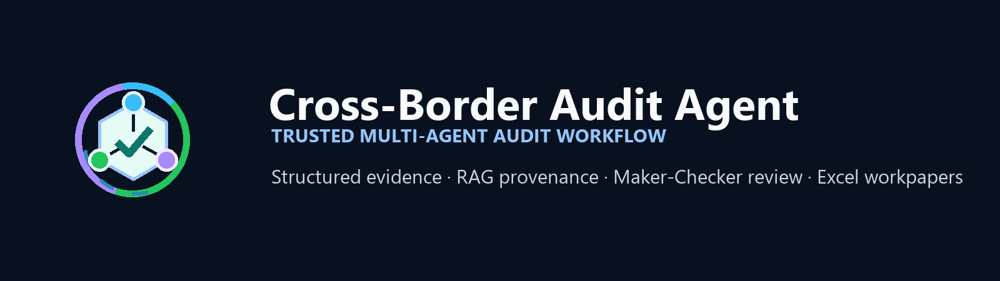
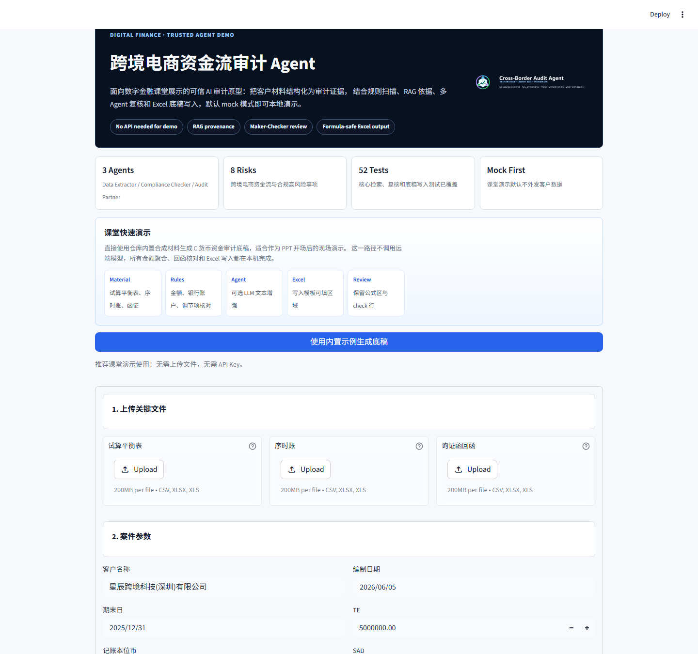
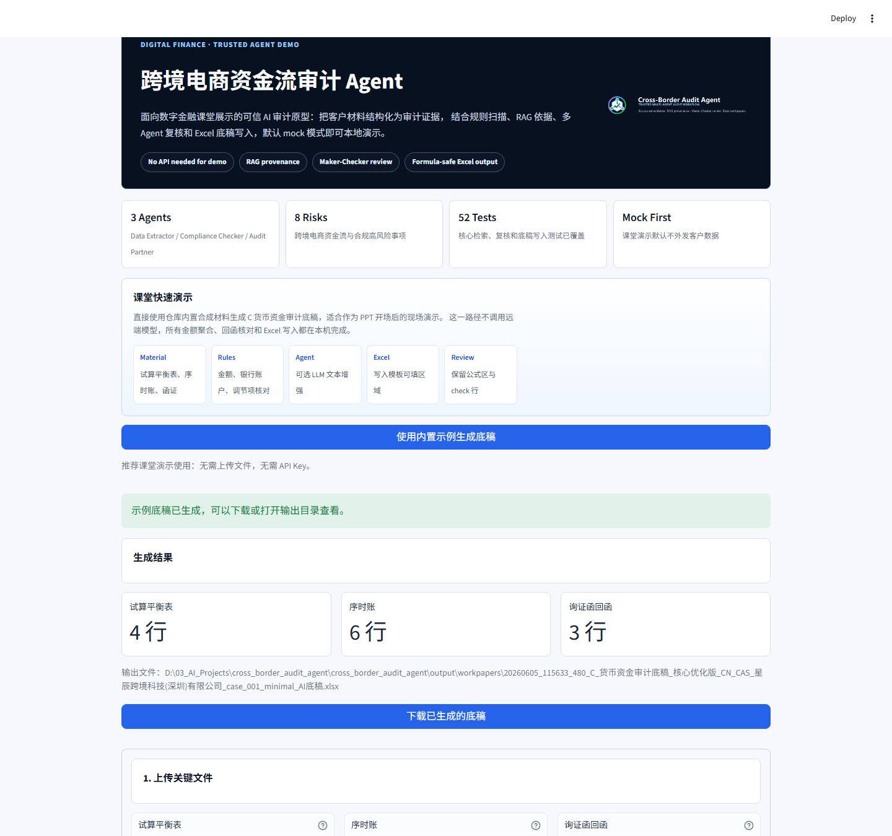

<p align="center">
  
</p>

# Cross-Border Audit Agent

> 面向数字金融课堂与审计场景的可信多 Agent 原型：把跨境电商资金流、银行材料和审计准则证据组织成可复核的审计报告与 Excel 工作底稿。

[](runtime.txt)
[](streamlit_app.py)
[](tests)
[](#quick-start)

## What It Does

This project is not a chat-only audit demo. It is a workflow prototype for trusted audit assistance:

- **Cross-border risk scan**: covers 8 common high-risk issues in cross-border e-commerce fund flows, including related-party service fees, FBA NRV, multi-currency revenue recognition, import tax, refund reserve, and FX exposure.
- **Multi-Agent reasoning**: Data Extractor identifies facts, Compliance Checker links standards and procedures, and Audit Partner challenges evidence gaps.
- **RAG evidence layer**: audit snippets and compliance knowledge can be searched with vector, BM25, RRF, fallback, and optional reranking components.
- **Excel workpaper generation**: uploaded trial balance, journal, and bank confirmation materials are normalized and written into a clean C cash workpaper template.
- **Trust controls**: mock mode runs without API keys, formula regions are protected by cell maps, and benchmark materials are separated from ground truth.

## Demo Screenshot

> Screenshots are generated from the local Streamlit demo and stored under `docs/assets/`.





## Quick Start

```powershell
git clone https://github.com/wangzichang224-design/cross_border_audit_agent.git
cd cross_border_audit_agent

python -m pip install -r requirements-phase1.txt
streamlit run streamlit_app.py
```

For classroom or LAN sharing:

```powershell
streamlit run streamlit_app.py --server.address 0.0.0.0 --server.port 8501
```

Then open `http://<your-wlan-ip>:8501`. See [`docs/DEMO_RUNBOOK.md`](docs/DEMO_RUNBOOK.md) for the IP check command and classroom flow.

## CLI Commands That Actually Run

```powershell
# Environment and output folders
python cli.py doctor
python cli.py where

# Cross-border e-commerce audit report, no API key required
python cli.py run --case-type cross_border --mode mock

# Generate C cash workpaper from bundled synthetic materials
python cli.py workpaper --case-type cash --mode mock `
  --materials-dir benchmarks/materials/case_001_minimal `
  --template-root outputs/clean_templates `
  --template-keyword 核心优化版

# Search local audit knowledge snippets
python cli.py search --query "转让定价 BEPS 关联方" --top-k 3
```

`autogen` mode can call an OpenAI-compatible provider such as DeepSeek after `.env` is configured. The classroom demo should use `mock` mode unless the materials are already desensitized.

## System Architecture

```mermaid
flowchart LR
    A["Client materials<br/>trial balance / journal / bank confirmation"] --> B["Material normalization<br/>CSV / XLSX / PDF parsing"]
    B --> C["Rules and structure<br/>risk scan / reconciliation / cell-safe fields"]
    C --> D["RAG evidence layer<br/>audit snippets / standards / fallback retrieval"]
    D --> E["Multi-Agent review<br/>Data Extractor / Compliance Checker / Audit Partner"]
    E --> F["Maker-Checker loop<br/>structured verdict / bounded retry"]
    F --> G["Outputs<br/>Markdown report / Excel workpaper"]
    G --> H["Human review<br/>formula checks / evidence gaps / next procedures"]
```



## Repository Map

```text
cross_border_audit_agent/
├─ streamlit_app.py              # classroom UI and upload-to-workpaper demo
├─ cli.py                        # command center: doctor / where / run / workpaper / search
├─ audit_rag/                    # RAG, agents, reviewer, orchestrator, reporting
├─ benchmarks/                   # synthetic cash workpaper benchmark and ground truth
├─ outputs/clean_templates/      # clean C cash workpaper template
├─ sample_data/                  # fixed asset and cross-border voucher samples
├─ sample_knowledge/             # CPA / CAS / cross-border audit snippets
├─ assets/brand/                 # original logo SVG/PNG assets
├─ docs/                         # structure notes, demo runbook, screenshots
└─ tests/                        # regression coverage for retrieval, critic, and workpaper filling
```

## Why It Is Useful For Digital Finance

Audit and finance workflows need AI that can be checked, not just AI that can answer. This prototype treats LLMs as one layer in a controlled workflow:

- deterministic rules handle balances, periods, reconciliation, and formula-safe fields;
- RAG supplies traceable audit context instead of unsupported conclusions;
- the Agent layer explains risk and suggests procedures, while human reviewers keep final judgment;
- benchmark design separates visible materials from hidden answers so future Precision / Recall / F1 evaluation is possible.

## Verification

Current local verification:

```text
52 passed in pytest
python cli.py doctor  # mock mode usable; API keys optional
python cli.py where   # output folders and latest workpapers detected
```

Generated reports and workpapers are intentionally ignored by Git:

```text
output/audit_reports/
output/workpapers/
output/uploaded_materials/
```

## Notes

This repository is for learning, prototyping, and classroom demonstration. It is not a substitute for a CPA's professional judgment. Real client data should be desensitized or handled through a private deployment path before any remote LLM call.
