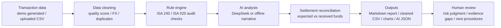

<p align="center">
  
</p>

# Cross-Border Audit Agent

> 面向数字金融课堂与审计场景的跨境电商资金流 AI 审计原型：从平台交易流水出发，完成数据清洗、规则异常扫描、DeepSeek/离线审计叙述、资金核对和可复核报告输出。

[](runtime.txt)
[](streamlit_app.py)
[](tests)
[](#quick-start)

## What It Does

This project is a classroom-ready prototype for trusted audit assistance in cross-border e-commerce:

- **Synthetic Anker-style transaction data**: generates Q4 platform fund-flow records across Amazon, TikTok Shop, Shopify, Walmart, eBay, and direct sales.
- **Rule-based audit scan**: flags high-risk patterns such as large settlement batches, advertising overspend, refund spikes, unauthorized FX conversion, ERP migration gaps, and duplicate entries.
- **DeepSeek / offline analysis**: optional OpenAI-compatible API call for AI audit narrative; offline mode still produces deterministic rule findings.
- **Evidence-oriented reporting**: outputs a Markdown audit report, cleaned CSV, charts, risk list, and optional AI JSON for human review.
- **Trust boundary**: demo data is synthetic; real client data should be desensitized or handled through private deployment.

## Demo Screenshot

> Screenshots are generated from the local Streamlit demo and stored under `docs/assets/`.


## Quick Start

```powershell
git clone https://github.com/wangzichang224-design/cross_border_audit_agent.git
cd cross_border_audit_agent

python -m pip install -r requirements-phase1.txt
streamlit run streamlit_app.py
```

For classroom or LAN sharing:

```powershell
streamlit run streamlit_app.py --server.address 0.0.0.0 --server.port 8501
```

Then open `http://<your-wlan-ip>:8501`. See [`docs/DEMO_RUNBOOK.md`](docs/DEMO_RUNBOOK.md) for the IP check command and classroom flow.

## CLI Commands That Actually Run

```powershell
# Environment and output folders
python cli.py doctor
python cli.py where

# Cross-border e-commerce audit report, no API key required
python cli.py run --case-type cross_border --mode mock

# Optional: use configured DeepSeek / OpenAI-compatible API
python cli.py run --case-type cross_border --mode autogen

# Search local audit knowledge snippets
python cli.py search --query "转让定价 BEPS 关联方" --top-k 3
```

## System Architecture



## Repository Map

```text
cross_border_audit_agent/
├─ streamlit_app.py              # classroom UI: data source, config, run audit, results
├─ cli.py                        # command center: doctor / where / run / search
├─ src/                          # single-agent fund-flow pipeline and DeepSeek client
├─ audit_rag/                    # multi-agent RAG prototype, reviewer, reporting
├─ sample_data/                  # fixed asset and cross-border voucher samples
├─ sample_knowledge/             # CPA / CAS / cross-border audit snippets
├─ assets/brand/                 # original logo SVG/PNG assets
├─ docs/                         # structure notes, demo runbook, screenshots
└─ tests/                        # regression coverage for retrieval, critic, and audit logic
```

## Why It Is Useful For Digital Finance

Audit and finance workflows need AI that can be checked, not just AI that can answer. This prototype treats LLMs as one layer in a controlled workflow:

- deterministic rules handle transaction quality, thresholds, FX anomalies, and platform settlement patterns;
- optional AI narrative explains risk but does not replace auditor review;
- report artifacts and cleaned data make the conclusion easier to inspect;
- synthetic data allows classroom demonstration without exposing client information.

## Verification

Current local verification:

```text
52 passed in pytest
python cli.py doctor  # mock mode usable; API keys optional
python cli.py where   # output folders detected
```

Generated audit outputs are intentionally ignored by Git:

```text
output/audit_reports/
output/synthetic_data/
```

## Notes

This repository is for learning, prototyping, and classroom demonstration. It is not a substitute for a CPA's professional judgment. Real client data should be desensitized or handled through a private deployment path before any remote LLM call.
