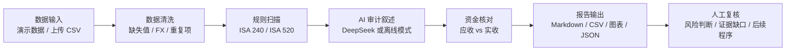

# Project Structure

Cross-Border Audit Agent 是一个面向跨境电商资金流审计的课堂展示原型。主线是：生成或上传平台交易流水，完成数据清洗、规则异常扫描、可选 DeepSeek 审计叙述、资金核对和报告输出。

## Top-Level Map

```text
cross_border_audit_agent/
├─ streamlit_app.py              课堂演示前端：审计配置、开始审计、结果展示
├─ cli.py                        命令中心：doctor / where / run / search
├─ src/                          资金流审计流水线
│  ├─ data_ingestion/            Anker 风格合成交易数据与结算计划
│  ├─ cleaning/                  数据清洗、质量评分、异常字段处理
│  ├─ audit/                     ISA 240 / ISA 520 规则扫描
│  ├─ llm/                       DeepSeek / OpenAI-compatible 客户端
│  ├─ reporting/                 Markdown 报告与图表生成
│  └─ agent/                     Perceive → Decide → Act 编排器
├─ audit_rag/                    多 Agent + RAG 原型层
├─ sample_data/                  固定资产与跨境电商样本凭证
├─ sample_knowledge/             CPA / CAS / 跨境审计知识片段
├─ knowledge_sources/            可放入外部准则 PDF
├─ output/                       运行生成的报告、图表和清洗后数据
├─ assets/brand/                 Logo SVG/PNG
├─ docs/                         结构说明、演示 runbook、截图
└─ tests/                        检索、复核、规则和材料处理回归测试
```

## Runtime Flow



## Key Modules

| Layer | Path | Role |
|---|---|---|
| Demo UI | `streamlit_app.py` | 课堂前端，展示配置、流水线阶段、结果和下载 |
| CLI | `cli.py` | 本地诊断、运行跨境审计、搜索知识库 |
| Data generation | `src/data_ingestion/` | 生成 Anker 风格多平台交易流水 |
| Cleaning | `src/cleaning/` | 清洗交易数据并输出质量评分 |
| Rule audit | `src/audit/` | 规则异常扫描与风险发现 |
| LLM layer | `src/llm/deepseek_client.py` | DeepSeek 分类、审计叙述和资金核对 |
| Reporting | `src/reporting/` | Markdown 报告和可视化图表 |
| RAG / Multi-Agent | `audit_rag/` | 知识检索、三 Agent 讨论、Maker-Checker 复核原型 |

## Common Commands

```powershell
python cli.py doctor
python cli.py where
python cli.py run --case-type cross_border --mode mock
python cli.py search --query "跨境电商 收入确认 外币折算" --top-k 3
```

## One-Sentence Project Explanation

> 我做的是一个数字金融场景下的跨境电商资金流 AI 审计 Agent。它不是让模型自由聊天，而是先用确定性代码处理交易清洗和规则异常，再让 AI 辅助解释风险，最后把风险清单、图表和报告交给审计人员复核。
