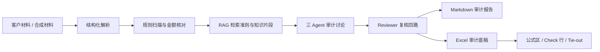

# 项目结构介绍

Cross-Border Audit Agent 是一个面向跨境电商资金流和货币资金审计的可信 Agent 原型。它把客户材料结构化为审计证据，结合规则扫描、RAG 检索、多 Agent 复核回路，并输出 Markdown 审计报告或 Excel 标准底稿。

## 一句话定位

这不是“聊天式审计助手”，而是一套可追溯、可人工复核、可继续评测的审计工作流原型。

## 目录总览

```text
cross_border_audit_agent/
├─ streamlit_app.py              课堂演示前端：内置示例 + 上传材料生成底稿
├─ cli.py                        命令中心：doctor / where / run / workpaper / search
├─ audit_rag/                    核心审计 Agent、RAG、复核和报告模块
├─ benchmarks/                   货币资金底稿 Benchmark 与材料隔离区
├─ outputs/clean_templates/      无品牌 C 货币资金干净模板
├─ sample_data/                  固定资产与跨境电商样本凭证
├─ sample_knowledge/             CPA / CAS / 跨境审计知识片段
├─ assets/brand/                 原创项目 Logo SVG / PNG
├─ docs/                         项目结构、演示 Runbook、截图素材
└─ tests/                        自动化回归测试
```

## 分层说明

| 层级 | 路径 | 作用 |
|---|---|---|
| 前端演示层 | `streamlit_app.py` | 局域网课堂演示、内置示例生成、上传试算平衡表/序时账/询证函回函 |
| CLI 入口层 | `cli.py` | 统一暴露 `doctor`、`where`、`run`、`workpaper`、`search` |
| Agent 核心层 | `audit_rag/` | 多 Agent 审计流水线、RAG、Maker-Checker 复核、报告生成 |
| Benchmark 层 | `benchmarks/` | 材料、Agent 输出、ground truth 隔离，支持后续量化评测 |
| 模板层 | `outputs/clean_templates/` | 无品牌 C 货币资金底稿模板 |
| 品牌资产层 | `assets/brand/` | README、前端、PPT 共用 Logo 资产 |

## 核心链路



## `audit_rag/`：审计推理内核

| 文件 | 职责 |
|---|---|
| `pipeline.py` | 主编排：加载凭证、规则扫描、RAG 检索、Agent 讨论、报告输出 |
| `agents.py` | Data Extractor、Compliance Checker、Audit Partner 三个 Agent |
| `critic.py` | Reviewer Agent，输出结构化 verdict |
| `orchestrator.py` | Maker-Checker 复核回路，支持有界重试和人工升级 |
| `rag.py` | 知识库入口，封装向量检索和关键词 fallback |
| `hybrid_retriever.py` | BM25 + 向量 + RRF 混合检索 |
| `reranker.py` | 交叉编码 rerank，提高准则命中质量 |
| `data_tools.py` | Voucher、Finding 数据结构与规则引擎 |
| `reporting.py` | Markdown 审计报告生成 |

## `benchmarks/`：货币资金底稿评测设计

Benchmark 的关键不是“能填表”，而是“未来能被客观评分”。因此材料、标准答案、Agent 输出被物理隔离。

| 路径 | Agent 是否可见 | 内容 |
|---|---:|---|
| `benchmarks/materials/` | 可见 | 客户交付材料，如银行流水、函证、GL、余额调节表 |
| `benchmarks/agent/` | 可见 | 材料加载、上下文构建、Excel cell 写入 |
| `benchmarks/ground_truth/` | 不可见 | 标准答案、错误清单、预期识别结果 |
| `benchmarks/generators/` | 开发期使用 | 拟真客户材料与错误注入生成器 |

## 常用命令

```powershell
streamlit run streamlit_app.py --server.address 0.0.0.0 --server.port 8501
python cli.py doctor
python cli.py where
python cli.py run --case-type cross_border --mode mock
python cli.py workpaper --case-type cash --mode mock --materials-dir benchmarks\materials\case_001_minimal --template-root outputs\clean_templates --template-keyword 核心优化版
```

## 课堂讲法

可以把项目概括为：

> 我做的是一个数字金融场景下的可信审计 Agent。它不是直接让大模型给结论，而是先把材料结构化，用本地规则处理金额和底稿写入，再用 RAG 和多 Agent 复核补充审计判断。这样既能演示 AI 的推理能力，也保留证据链、公式区保护和人工复核边界。
