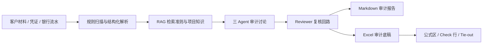
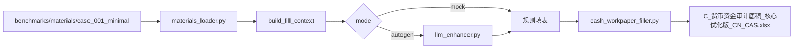

# Cross-Border Audit Agent 项目结构介绍

本文档用于 GitHub 仓库展示和面试讲解，帮助读者快速理解这个项目不是单一脚本，而是一套审计 Agent、RAG、底稿生成和 Benchmark 评测系统。

## 一句话定位

Cross-Border Audit Agent 是一个面向跨境电商和货币资金审计场景的多 Agent 原型。它把客户材料结构化为审计证据，结合规则扫描、RAG 检索、Maker-Checker 复核回路，并最终输出 Markdown 审计报告或 Excel 标准底稿。

## 核心链路



## 目录总览

```text
cross_border_audit_agent/
├─ audit_rag/                  核心审计推理系统
├─ benchmarks/                 货币资金底稿 Benchmark 与材料隔离区
├─ outputs/clean_templates/    无品牌 C 货币资金干净模板
├─ scripts/                    工作底稿、知识库、演示工具脚本
├─ sample_data/                固定资产与跨境电商样本凭证
├─ sample_knowledge/           CPA / 跨境审计知识片段
├─ tests/                      自动化测试
├─ cli.py                      统一命令行入口
└─ streamlit_app.py            上传材料并生成底稿的极简前端
```

## 分层说明

| 层级 | 路径 | 作用 |
|---|---|---|
| 前端入口层 | `streamlit_app.py` | 上传试算平衡表、序时账、询证函回函并生成可下载底稿 |
| CLI 入口层 | `cli.py` | 统一暴露 `run`、`workpaper`、`search`、`doctor`、`paysim` |
| Agent 核心层 | `audit_rag/` | 多 Agent 审计流水线、RAG、复核回路、报告生成 |
| Benchmark 层 | `benchmarks/` | 货币资金材料、答案、Agent 输出隔离，后续支持量化评分 |
| 模板层 | `outputs/clean_templates/` | 原创无品牌 C 货币资金底稿模板 |
| 测试层 | `tests/` | 核心模块回归测试，当前覆盖货币资金填表与 RAG 复核逻辑 |

## `audit_rag/`：审计推理内核

| 文件 | 职责 |
|---|---|
| `pipeline.py` | 主编排：加载凭证、规则扫描、RAG 检索、Agent 讨论、报告输出 |
| `agents.py` | Data Extractor、Compliance Checker、Audit Partner 三个 Agent |
| `critic.py` | Reviewer Agent，输出结构化 verdict |
| `orchestrator.py` | Maker-Checker 复核回路，支持有界重试和人工升级 |
| `rag.py` | 知识库入口，封装向量检索和关键词 fallback |
| `hybrid_retriever.py` | BM25 + 向量 + RRF 混合检索 |
| `reranker.py` | 交叉编码 rerank，提升准则命中质量 |
| `data_tools.py` | Voucher、Finding 数据结构与规则引擎 |
| `reporting.py` | Markdown 审计报告生成 |

## `benchmarks/`：货币资金底稿评测系统

Benchmark 的关键不是“能填表”，而是“能被客观评分”。因此材料、标准答案、Agent 输出被物理隔离。

| 路径 | Agent 是否可见 | 内容 |
|---|---:|---|
| `benchmarks/materials/` | 可见 | 客户交付材料，如银行流水、函证、GL、余额调节表 |
| `benchmarks/agent/` | 可见 | 材料加载、上下文构建、Excel cell 写入 |
| `benchmarks/ground_truth/` | 不可见 | 标准答案、错误清单、预期识别结果 |
| `benchmarks/generators/` | 开发期使用 | 拟真客户材料与错误注入生成器 |
| `benchmarks/evaluator/` | 后续扩展 | Precision、Recall、F1 评分器 |

## 货币资金底稿生成链路



`mock` 模式不调用 API，适合测试和演示。`autogen` 模式调用 OpenAI-compatible API，只增强风险等级和审计说明文本，金额、公式、check 行仍由本地规则和 Excel 控制。

## 前端页面

前端入口是：

```powershell
streamlit run streamlit_app.py
```

前端现在只保留一条用户路径：

| 步骤 | 内容 |
|---|---|
| 上传关键文件 | 试算平衡表、序时账、询证函回函，支持 CSV / XLSX |
| 填写案件参数 | 客户名称、期末日、TE、SAD、记账本位币 |
| 生成并下载 | 自动整理材料包，写入核心优化版 C 货币资金底稿，提供 Excel 下载按钮 |

## 常用命令

```powershell
python cli.py doctor
python cli.py run --case-type cross_border --mode mock
python cli.py workpaper --case-type cash --mode mock --materials-dir benchmarks\materials\case_001_minimal --template-root outputs\clean_templates --template-keyword 核心优化版
streamlit run streamlit_app.py
```

## 面试讲法

我搭了一个跨境电商审计 Agent，包含混合检索 RAG、Maker-Checker 多 Agent 复核回路，以及一套带 ground truth 隔离的货币资金底稿 Benchmark。它不仅能生成审计报告和 Excel 工作底稿，还能逐步走向可量化评测，这比只展示聊天式审计 demo 更接近真实工程系统。
